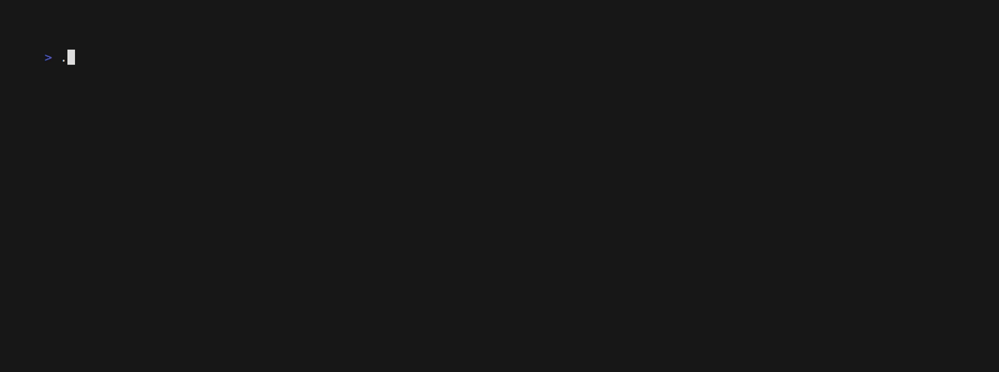

# Cloud Architecture CA1



## Reminder of instructions

Write a cloud-native app using lambda to send an order to a perticular store.
The app takes an order in, route it to the corresponding store and put the order in dynamodb in parallel.
Write the script that will show the orders in a perticular store.

## How I did it

I'm using SQS queues for getting the orders and sending them to the store.
Everything is done in a single lambda.
I'm using AWS SAM to easily deploy the app.

See the diagram in `design.pdf`.

## Requirements

* [AWS SAM CLI](https://docs.aws.amazon.com/serverless-application-model/latest/developerguide/serverless-sam-reference.html#serverless-sam-cli)
* Python 3.9 or docker (for building)
* Module for python 
  * boto3 (`order_processor.py` & `tests/integration`)
  * pytest (`tests/integration`)
* Bash (setup, teardown and test scripts)

## Files

The repos contains: 

- order_router - Code for the application's Lambda function.
<!-- events - Invocation events that you can use to invoke the function.-->
- tests - Integration tests for the application code. 
- template.yaml - A template that defines the application's AWS resources.
- setup.sh - Deploy the lambda
- teardown.sh - Delete the stack and SAM bucket files
- test.sh - Automatic and manual test. Manual send orders one by one
- order_processor.sh - Script for a store to retrieve orders

## Lifestyle scripts

The bash scripts for setup, teardown and test will prompt you for a few information before doing anything, just let yourself guided through the instructions.

In `setup.sh`, if you choose the guided deployment, you will the asked the following: 

* **Stack Name**: The name of the stack to deploy to CloudFormation. This should be unique to your account and region, and a good starting point would be something matching your project name.
* **AWS Region**: The AWS region you want to deploy your app to.
* **Confirm changes before deploy**: If set to yes, any change sets will be shown to you before execution for manual review. If set to no, the AWS SAM CLI will automatically deploy application changes.
* **Allow SAM CLI IAM role creation**: Many AWS SAM templates, including this example, create AWS IAM roles required for the AWS Lambda function(s) included to access AWS services. By default, these are scoped down to minimum required permissions. To deploy an AWS CloudFormation stack which creates or modifies IAM roles, the `CAPABILITY_IAM` value for `capabilities` must be provided. If permission isn't provided through this prompt, to deploy this example you must explicitly pass `--capabilities CAPABILITY_IAM` to the `sam deploy` command.
* **Save arguments to samconfig.toml**: If set to yes, your choices will be saved to a configuration file inside the project, so that in the future you can just re-run `sam deploy` without parameters to deploy changes to your application.

The automatic deployment is the config I've used.

## Retrieve orders as store

Use the `order_processor.py` to get the orders from the SQS queue.

Usage:
```bash
./order_processor.py <STACK-NAME> <STORE-ID-NUMBER>
```

## Tests

Tests are defined in the `tests` folder in this project. Use PIP to install the test dependencies and run tests.

```bash
pip install -r tests/requirements.txt --user
```

Note that you need a decent internet connection to run the integration test.
